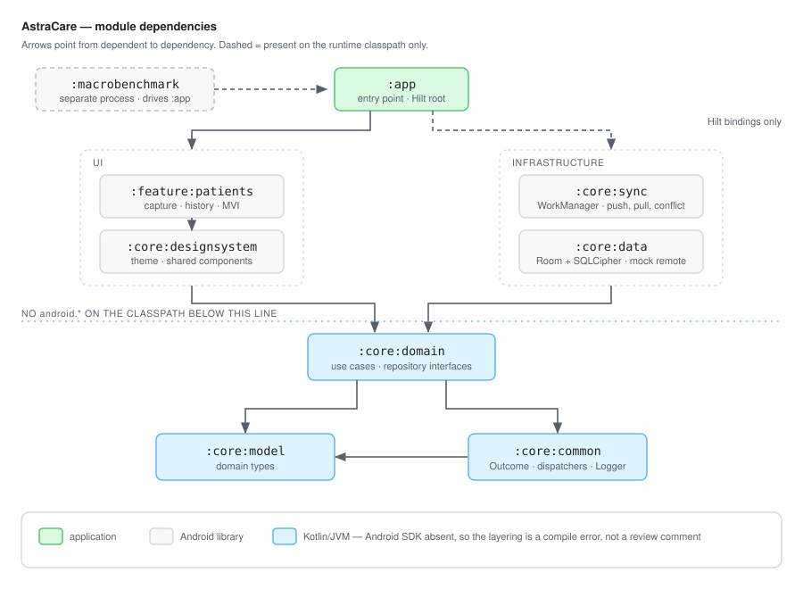

# AstraCare

[](https://github.com/sheenisaxena/Astracare/actions/workflows/ci.yml)

An offline-first Android field data capture app for community health workers operating in
low-bandwidth and intermittently connected environments.

> **Status: in active development.** The app captures records, stores them in an encrypted
> local database, syncs them in the background with conflict detection, and logs what happened
> to an append-only trail. See [Current state](#current-state) for what exists and
> [Deliberate scope boundaries](#deliberate-scope-boundaries) for what deliberately never will.

---

## The problem

A community health worker records patient measurements in a village with no usable mobile
data. The app has to accept that data, keep it safe on the device, and reconcile it with the
server whenever connectivity returns — possibly hours later, possibly after the same record
was edited elsewhere.

That makes three things non-negotiable:

- **The local database is the source of truth**, not a cache of a remote response. The UI reads
  from disk and never waits on a network call.
- **Sync is a background queue with conflict resolution**, not a request/response cycle. Writes
  are idempotent and retried with exponential backoff.
- **Data at rest is sensitive.** Records contain personally identifying health information, so
  field-level encryption and an audit trail are requirements rather than enhancements.

## Screens

<!--
  Recording pending. To capture, with a device attached:

    adb shell screenrecord --time-limit 20 --size 720x1560 /sdcard/capture.mp4
    adb pull /sdcard/capture.mp4 .
    ffmpeg -i capture.mp4 -vf "fps=12,scale=360:-1:flags=lanczos,split[a][b];\
      [a]palettegen[p];[b][p]paletteuse" -loop 0 docs/media/capture-to-history.gif

  Then drop the files in docs/media/ and uncomment:

  | Capture | History | Audit trail |
  |---|---|---|
  |  |  |  |

  
-->

Screen recordings are not in the repository yet. The journey they would show — capture a record,
watch it save locally and appear in the history list marked *Pending* — is covered end to end by
`CaptureToHistoryTest`, which runs on every `./gradlew test`.

## Architecture

Multi-module, layered, with unidirectional data flow.



| Module | Type | Responsibility |
|---|---|---|
| `:app` | Android application | Entry point, Hilt root component, navigation shell |
| `:feature:patients` | Android library | Capture screen, record history, MVI ViewModels |
| `:core:designsystem` | Android library | Compose Material 3 theme and shared components |
| `:core:sync` | Android library | WorkManager sync engine, backoff, conflict detection |
| `:core:data` | Android library | Room + SQLCipher, mock remote, repository implementations |
| `:core:domain` | **Kotlin/JVM** | Use cases and repository *interfaces* |
| `:core:model` | **Kotlin/JVM** | Pure domain models |
| `:core:common` | **Kotlin/JVM** | `Outcome`, dispatchers, `Logger`, shared extensions |
| `:macrobenchmark` | Android test | Cold-start measurement and baseline profile generation |

Three things in that graph are deliberate and worth naming:

- **`:core:domain`, `:core:model` and `:core:common` are Kotlin/JVM modules, not Android
  modules.** The Android SDK is not on their compile classpath, so an `import android.*` in the
  domain layer is a compile error rather than a review comment.
- **Nothing in the UI column depends on `:core:data`.** The feature layer talks to repository
  *interfaces* in `:core:domain`; the implementations sit beside it, not beneath it. Swapping
  Room for something else touches one module.
- **`:app` depends on `:core:data` and `:core:sync` without naming a single type from either.**
  Both are there purely so their Hilt `@Binds` reach the runtime classpath when the singleton
  component is assembled. The dashed arrows in the diagram are that relationship.

The same principle drives the Gradle setup: convention plugins are split by capability, so
Compose and Hilt are simply absent from modules that should not use them.

## Read this repo in ten minutes

If you are reviewing this and want the signal without reading eight modules:

1. **[docs/DECISION_LOG.md](docs/DECISION_LOG.md)** — the point of the project. Every structural
   choice with the alternative that was rejected and why. Start at Part 9 (conflict resolution)
   or Part 10 (encryption) if you only read one.
2. **`core/domain/.../sync/ConflictResolver.kt`** — the hardest logic in the app, and the one
   place where "offline-first" stops being a slogan. Conflict detection keys on sync status,
   never on comparing clocks.
3. **`core/data/.../crypto/DatabasePassphrase.kt`** — Keystore-wrapped SQLCipher passphrase,
   including what happens when the key is gone but the encrypted blob is not.
4. **`app/src/test/.../CaptureToHistoryTest.kt`** — the end-to-end journey, and the two real
   bugs it found on its first run (DECISION_LOG 14.9 and 14.10).
5. **`build-logic/`** — eight convention plugins, SDK and Java levels defined once.

## Stack

Kotlin · Jetpack Compose · Material 3 · Hilt · Room · SQLCipher · WorkManager · Paging 3 ·
Coroutines & Flow · KSP · JUnit · Turbine · MockK · Robolectric · Macrobenchmark · detekt ·
Gradle convention plugins

## Build and run

```bash
./gradlew assembleDebug
./gradlew test       # unit tests + the Robolectric end-to-end UI test
./gradlew detekt     # static analysis + ktlint, maxIssues = 0
```

JDK 21 · Gradle 9.5 · AGP 9.3.1 · `compileSdk` 37 · `minSdk` 24.

**[docs/BUILDING.md](docs/BUILDING.md)** covers environment setup — including the `JAVA_HOME`
requirement that makes the git hooks fail while the IDE build succeeds — the instrumented and
benchmark commands, and the known tooling gaps.

## Current state

**In place**

- Eight-module structure with compiler-enforced layer boundaries, plus `:macrobenchmark`
- `build-logic` included build with eight capability-scoped convention plugins; SDK and Java
  levels defined once
- Version catalog covering the full dependency set
- Hilt graph bootstrapped, with injected coroutine dispatchers for testability
- Domain model and use cases; Room as the single source of truth, schema v4 with hand-written
  migrations and no destructive fallback
- Compose capture screen with MVI state management; paged record history ordered in SQL
- WorkManager sync: push, pull, and conflict detection keyed on sync status rather than clocks
- Database encrypted at rest with SQLCipher, passphrase wrapped by an Android Keystore key
- Two roles with a declarative permission matrix, and an append-only audit trail
- 155 JVM tests, including an end-to-end Compose journey on Robolectric and a test asserting
  that no personally identifying information reaches the log
- Instrumented tests for every migration, the `CASE` ordering, the conditional writes and the
  append-only triggers — written, and runnable on demand rather than in CI
- `:macrobenchmark` module measuring cold start against three compilation modes, with
  `reportFullyDrawn` wired so the metric is the frame carrying records rather than the spinner
- Baseline profile generator covering launch *and* the first interaction, with
  `BaselineProfileMode.Require` so a missing profile fails the run instead of quietly
  reporting an unimproved number as an improvement

**Next**

- Take both readings on a phone and fill in [docs/PERFORMANCE.md](docs/PERFORMANCE.md)
- An instrumented CI lane, so the database tests run on every push rather than on request
- R8 enabled for release builds

## Design decisions

**[docs/DECISION_LOG.md](docs/DECISION_LOG.md)** records the reasoning behind each structural
choice and the alternative rejected — including why the domain modules are Kotlin/JVM, why
convention plugins live in an included build rather than `buildSrc`, and why Room 2.x was
chosen over the newer `room3`.

**[docs/PERFORMANCE.md](docs/PERFORMANCE.md)** holds the measured numbers and the conditions
that produced them — device, build type, iteration count and commit beside every figure, on the
principle that a number missing any of those is not a measurement.

## Deliberate scope boundaries

Stated because they are choices, not omissions:

- **No real backend.** The remote source is a mock; a production server would demonstrate
  nothing about Android engineering.
- **Client-side role gating is a UX affordance, not a security boundary.** The client is under
  the user's control; the server is the only real authorisation point. The app has no sign-in
  at all — the role switch in the UI says so on screen. Permissions are still enforced below
  the UI, because hiding a button and refusing an action are different guarantees, but that is
  correctness rather than security. See DECISION_LOG 11.2.
- **The audit trail is a local activity log, not an accountability record.** It records a
  *role*, not a person, because there is nobody to authenticate against. Anyone holding the
  handset can change the role; the change is itself logged, which makes tampering visible and
  not impossible. A real audit requirement is met by a server recording what it receives from
  an authenticated principal, in storage the client cannot reach. See DECISION_LOG 11.5.
- **One entity, one capture screen, one sync path.** Depth over breadth — a second entity adds
  volume without demonstrating anything new.
- **Kotlin Multiplatform is not used.** The pure-Kotlin domain modules would make extraction
  feasible, but it is not claimed as shipped.

## Data protection

The records are children's names, ages, villages and body measurements, held on a handset in
the field. India's Digital Personal Data Protection Act, 2023 and the DPDP Rules notified in
November 2025 are the relevant regime, and they are phased in over the period following
notification.

**This project does not claim DPDP compliance**, and none of the following is legal advice —
a real deployment needs counsel and a Data Protection Officer's review, not a README. What the
build does do is follow the principles the Act is built on, where an Android client is the
right place to follow them:

- **Data minimisation.** The schema holds only fields a malnutrition screening actually uses.
  There is no phone number, no address beyond a village name, no caregiver identifier, and no
  device or advertising identifier. Record IDs are device-minted UUIDs carrying no meaning.
- **Purpose limitation.** One entity, one purpose. Nothing here is collected for analytics, and
  the app has no analytics SDK.
- **Storage limitation, partially.** Drafts are cleared on save or discard. Records are not yet
  subject to a retention window, which is an open item rather than a decision — retention
  belongs with the server that would enforce it.
- **Security safeguards.** Encryption at rest (SQLCipher, Keystore-wrapped key), backup and
  device-transfer both disabled so the database cannot be extracted through those channels,
  `FLAG_SECURE` on release builds so the recents thumbnail is not a screenshot of a child's
  name, and no cleartext traffic permitted. DECISION_LOG Part 10 states what this protects
  against and, more importantly, what it does not.
- **Accountability.** An append-only audit trail, with its limits stated above and in
  DECISION_LOG 11.5 rather than overstated.

**The largest stated gap:** the data subjects are children under five, and DPDP places
additional obligations on processing children's personal data — including verifiable parental
consent. This app implements no consent capture, no notice, and no grievance mechanism. Those
are not client-side features, and pretending otherwise would be the wrong kind of completeness.

## Licence

Not yet licensed. All rights reserved.
